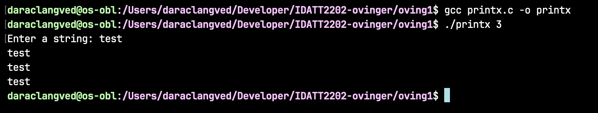
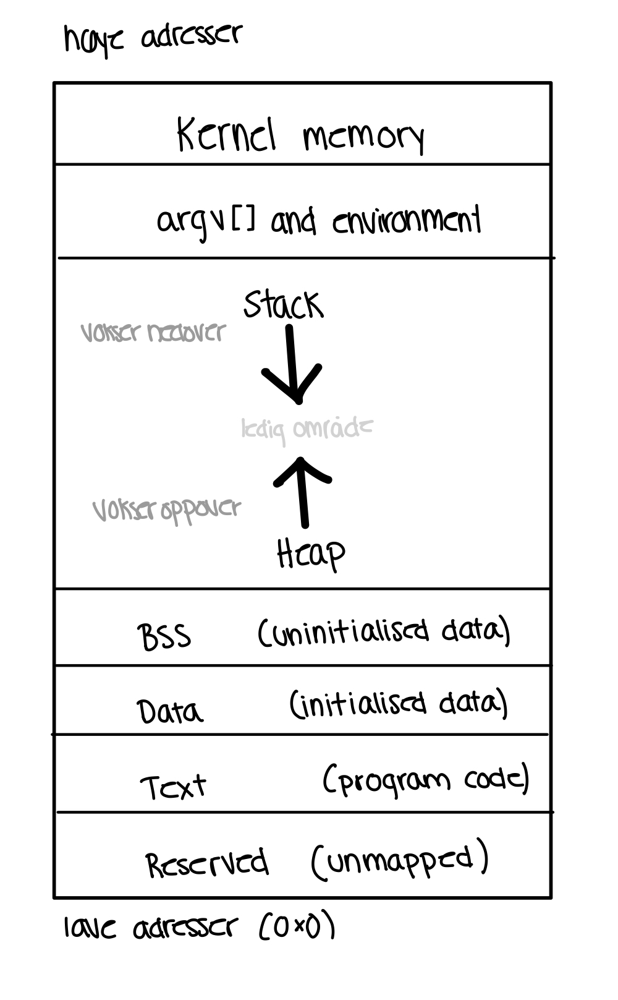
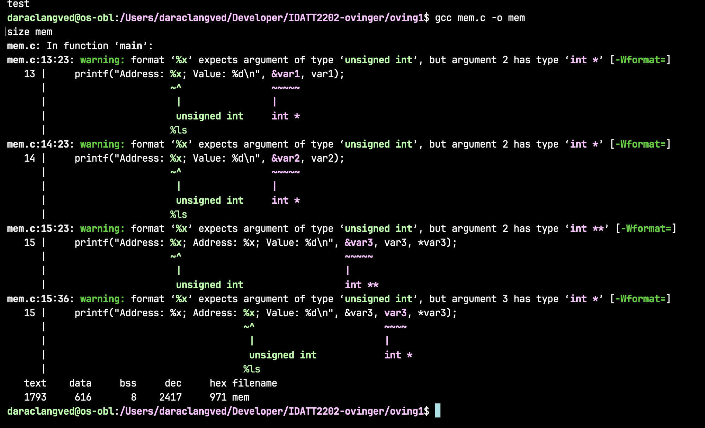
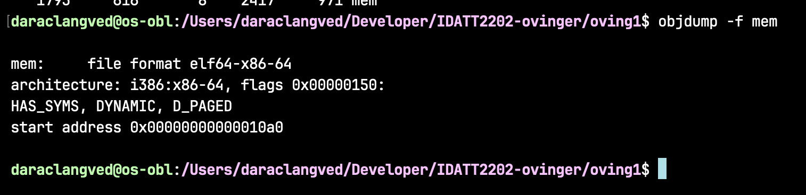
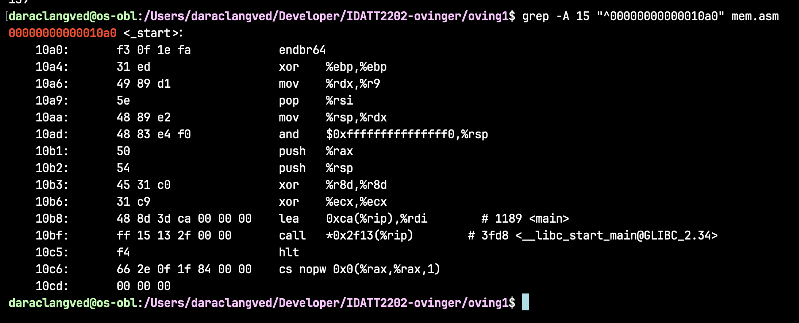
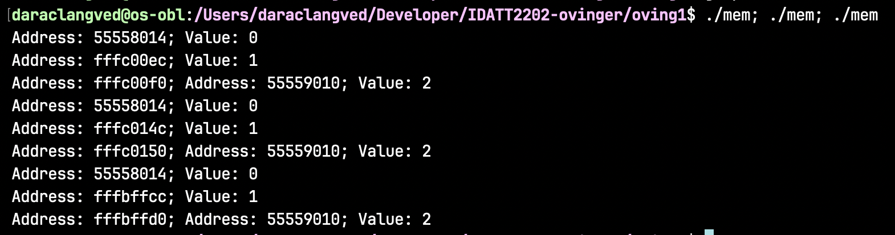
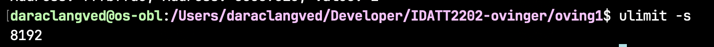
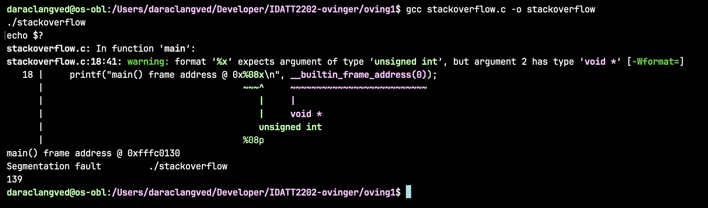
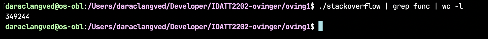
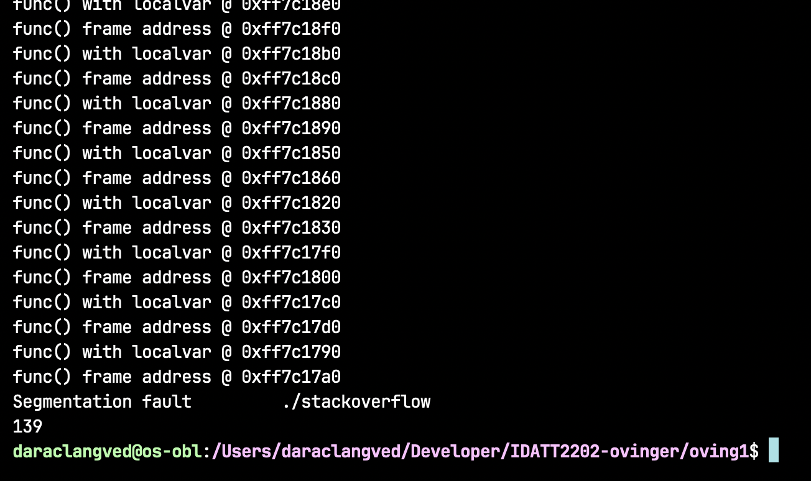

# 1. The process abstraction

### 1.1 What happens when a process is started from a program on a disk?
Et program som ligger på disken er bare en fil med data. For at det skal kunne kjøre må
operativsystemet laste programmet inn i minnet og opprette en prosess. På UNIX-systemer
brukes fork() og exec(). fork() lager en ny prosess som er en kopi av den eksisterende
(vanligvis med copy-on-write, slik at minnet ikke faktisk kopieres), mens exec() erstatter
innholdet i prosessen med et nytt program. Grunnen til at dette er delt i to kall er at
mellomrommet mellom dem gjør det mulig å f.eks. endre input og output før programmet
starter. Windows bruker i stedet CreateProcess(), som gjør dette i ett kall.

Før programmet kan kjøre må operativsystemet gjøre flere forberedelser. Først opprettes en
PCB som inneholder informasjon om prosessen (prosess-ID, tilstand, registre, adresserom
osv.). Deretter får prosessen sitt eget virtuelle adresserom og egne sidetabeller, slik at
den holdes adskilt fra andre prosesser.

Programmet lastes så inn i minnet. Kjernen leser ELF-filen og mapper kode og data inn i
adresserommet. I Linux brukes demand paging, der deler av programmet først lastes inn når
de faktisk trengs. Samtidig opprettes heap og stack, og argumenter og miljøvariabler legges 
på stacken i det formatet oppstartskoden forventer, slik at programmet får dem som argc og argv i main().

Til slutt initialiseres registrene. Program counter settes til programmets startpunkt
(entry point, vanligvis _start), mens stack pointer settes til toppen av stacken. Når dette
er klart legges prosessen i kø for kjøring, og scheduleren bestemmer når den får CPU-tid.

Modusbyttet er nødvendig fordi kjernen kjører med høyere privilegier enn vanlige programmer.
I kjernemodus kan CPU-en blant annet endre sidetabeller og få direkte tilgang til
maskinvaren. Privilegienivået håndheves av maskinvaren selv (ring 0 mot ring 3 på x86), ikke
av operativsystemet i programvare. Uten dette skillet kunne et vanlig program lest andre
prosessers minne, styrt maskinvaren direkte, eller deaktivert timer-interrupts og dermed
hindret operativsystemet i å ta tilbake kontrollen over CPU-en.

Når et systemkall som exec() utføres, går CPU-en fra brukermodus til kjernemodus. Når
kjernen er ferdig med å sette opp programmet, utføres en return-from-trap (iret eller sysret
på x86). Denne instruksjonen gjenoppretter registrene fra kjernestacken, setter program
counter til programmets startpunkt og senker privilegienivået i én og samme operasjon.
Nettopp fordi dette skjer atomisk, kan ikke et brukerprogram hoppe inn i kjernemodus på egen
hånd. Resultatet er at programmet kan kjøre, men uten de samme privilegiene som kjernen har.

### 1.2 Kjøring av printx.c



```c
#include <stdio.h>
#include <stdlib.h>
#include <string.h>

int main(int argc, char *argv[]) {
    if (argc != 2) {
        fprintf(stderr, "Usage: %s <count>\n", argv[0]);
        return 1;
    }
    int x = atoi(argv[1]);
    char str[100];

    printf("Enter a string: ");

    if (fgets(str, sizeof(str), stdin) == NULL) {
        fprintf(stderr, "Failed to read\n");
        return 1;
    }
    str[strcspn(str, "\n")] = '\0';

    for (int i = 0; i < x; i++) {
        printf("%s\n", str);
    }
    return 0;
}
```

## 2. Process memory and segments

### 2.1


### 2.2
Adresserommet til en prosess er de adressene prosessen kan bruke altså ikke det fysiske minnet den faktisk eier. Kjernen 
gir hver prosess sitt eget virtuelle adresserom med egne sidetabeller og maskinvaren oversetter virtuelle adresser til 
fysiske ved hvert minneaksess. Prosessen ser derfor ett sammenhengende adresserom, uavhengig av hvor i RAM dataene faktisk 
ligger og hva andre prosesser gjør.

Grunnen til at dette rommet er delt i segmenter er at innholdet har ulike behov. Noe skal aldri endres, noe endres hele
tiden, noe har en størrelse kjernen kjenner på forhånd og noe vokser mens programmet kjører. Ved å samle data med like 
egenskaper kan kjernen gi hvert område de rettighetene og den oppførselen det trenger.

Stacken holder lokale variabler, funksjonsargumenter og returadresser. Hvert funksjonskall legger på en ny stack frame og
den fjernes automatisk når funksjonen returnerer. Denne oppførselen krever ingen bokføring utover en stackpeker som flyttes
opp og ned, noe som gjør den svært rask, men resulterer i at lokale variabler forsvinner i det funksjonen er ferdig. 

Heapen brukes til dynamisk allokering med malloc(). Her er det programmet selv som bestemmer når minne tas i bruk og
når det frigis. Minnet lever da videre etter at funksjonen som allokerte det har returnert. Det er nettopp derfor heapen 
finnes, for uten den måtte alle minnebruk være kjent ved kompilering eller bundet til et funksjonskall.

Text segmentet ligger nederst og holder de kompilerte maskininstruksjonene. Størrelsen er kjent fra den kjørbare fila og 
innholdet endres aldri under kjøring. Derfor markeres segmentet som skrivebeskyttet, slik at programmet ikke kan overskrive 
sin egen kode ved et uhell. Det gjør også at flere prosesser som kjører samme program kan peke på én og samme kopi i 
fysisk minne i stedet for hver sin.

Rett over text ligger data segmentet som inneholder globale og statiske variabler. Disse lever like lenge som prosessen selv 
så de kan verken ligge på stacken eller i text. Segmentet er delt i to; variabler initialisert til en verdi som ikke er null 
får verdien lagret i den kjørbare fila og kopiert inn ved oppstart, mens uinitialiserte variabler og variabler satt til null havner i BSS.
BSS trenger ikke fila i det hele tatt.

Størrelsen på de to nederste segmentene er kjent når programmet lastes. Heap og stack derimot er de to områdene som vokser mens programmet kjører. 
De legges i hver sin ende av det ledige området mellom seg og vokser mot hverandre. De deler på den samme ledige plassen og
ingen av dem trenger en grense satt på forhånd.

Helt nederst i adresserommet ligger et område som ikke mappes. Adresse 0x0 er utilgjengelig for prosessen. Årsaken er at 0 er verdien pekere får 
når de er uinitialiserte eller når en allokering feiler (NULL). Fordi siden ikke er mappet vil et forsøk på å lese eller skrive gjennom en slik 
peker gi segmenteringsfeil med en gang. 

### 2.3 Global, statisk og lokal variabel
De tre variabeltypene skiller seg fra hverandre på tre punkter: hvor lenge de lever, hvem
som kan se dem, og hvilket segment de havner i.

En **global** variabel deklareres utenfor alle funksjoner. Den opprettes når programmet
lastes og lever helt til prosessen avsluttes. Den er synlig i hele programmet, også fra
andre kildefiler dersom de deklarerer den med `extern`. Den ligger i datasegmentet.

En **statisk** variabel har samme levetid som en global, altså hele programmets kjøretid,
men et snevrere synlighetsområde. `static` på filnivå gjør variabelen usynlig for andre
kildefiler, mens `static` inne i en funksjon gjør at bare den funksjonen ser den samtidig
som verdien overlever mellom kallene. Også statiske variabler ligger i datasegmentet, ikke
på stacken, nettopp fordi de må overleve at funksjonen returnerer.

En **lokal** variabel deklareres inne i en funksjon eller blokk. Den opprettes når
funksjonen kalles og forsvinner når den returnerer, og er bare synlig inne i blokken. Den
ligger på stacken, eller kun i et register hvis kompilatoren finner det raskere.

For både globale og statiske gjelder samme todeling av datasegmentet: initialiseres de til
en verdi forskjellig fra null, lagres verdien i den kjørbare fila og kopieres inn ved
oppstart. Er de uinitialiserte eller satt til null, havner de i BSS, som bare er en
størrelsesangivelse i fila og nullstilles av kjernen ved oppstart.

```c
#include <stdio.h>
#include <stdlib.h>

int var1 = 0;

void main()
{
    int var2 = 1;
    // Note, since we are using malloc(), var3 will be a pointer into the heap!
    // So the question is, where is the pointer stored?
    int *var3 = (int *)malloc(sizeof(int));
    *var3 = 2;
    printf("Address: %x; Value: %d\n", &var1, var1);
    printf("Address: %x; Value: %d\n", &var2, var2);
    printf("Address: %x; Address: %x; Value: %d\n", &var3, var3, *var3);
}
```

| Variabel | Type | Segment |
|---|---|---|
| `var1` | global, initialisert til 0 | Datasegmentet, nærmere bestemt **BSS** |
| `var2` | lokal | **Stacken** |
| `var3` | lokal peker | Selve pekeren ligger på **stacken**. De 4 bytene den peker på, ligger på **heapen** |

`var1` er verdt en kommentar. Den er initialisert, men til null, og da trenger ikke fila
lagre verdien i det hele tatt. Den havner derfor i BSS og ikke i det initialiserte
datasegmentet. Dette bekreftes av `nm`, som merker symbolet med `B` for BSS:

```
0000000000011014 0000000000000004 B var1
```

`var3` er poenget oppgaven peker på med hintet sitt. `malloc()` gir minne på heapen, men
*pekeren* er en helt vanlig lokal variabel i `main()` og ligger på stacken som alle andre
lokale variabler. Derfor skriver programmet ut to adresser for `var3`: `&var3` ligger i
stackområdet, mens `var3` peker langt lenger ned, i heapområdet.

## 3. Program code
Alle kjøringer under er gjort i en Linux-VM på x86-64 med gcc.

### 3.1 Størrelsen på text-, data- og BSS-segmentet
```bash
gcc mem.c -o mem
size mem
```



```
   text	   data	    bss	    dec	    hex	filename
   1793	    616	      8	   2417	    971	mem
```

`text` er koden. Den er langt større enn de få linjene i `mem.c` fordi oppstartskoden fra C
runtime (`crt1.o` og venner) lenkes inn i den kjørbare fila. `data` inneholder initialiserte
globale variabler, som også her nesten utelukkende stammer fra runtime og ikke fra min egen
kode. `bss` er på 8 byte: 4 av dem er `var1`, resten er justering og en intern
opprydningsvariabel fra runtime.

Merk at `var1` teller mot `bss` og ikke mot `data`, selv om den er skrevet som
`int var1 = 0;`. Siden verdien er null, er det nok for lenkeren å notere at det trengs 4
byte som nullstilles ved oppstart. `dec` og `hex` er bare summen av de tre, 2417 i
titallssystemet og `0x971` heksadesimalt.

Kompileringen gir også fire advarsler om at `%x` er feil formatstreng for en peker på et
64-bits system. Adressene blir derfor avkortet til de nederste 32 bitene i utskriften. Det
er verdt å huske på i 3.4.

### 3.2 Programmets startadresse
```bash
objdump -f mem
```



```
mem:     file format elf64-x86-64
architecture: i386:x86-64, flags 0x00000150:
HAS_SYMS, DYNAMIC, D_PAGED

start address 0x00000000000010a0
```

Startadressen er `0x10a0`. Det er ikke adressen til `main()`, men det stedet kjernen setter
program counter når prosessen starter. At adressen er så lav skyldes at fila er en PIE
(position independent executable). Adressen er relativ til der programmet lastes, og den
virkelige adressen under kjøring blir lastebase pluss `0x10a0`.

### 3.3 Disassemblering og funksjonen på startadressen
```bash
objdump -d mem > mem.asm
grep -A 15 "^00000000000010a0" mem.asm
```



```
00000000000010a0 <_start>:
    10a0:	f3 0f 1e fa          	endbr64
    10a4:	31 ed                	xor    %ebp,%ebp
    10a6:	49 89 d1             	mov    %rdx,%r9
    10a9:	5e                   	pop    %rsi
    10aa:	48 89 e2             	mov    %rsp,%rdx
    10ad:	48 83 e4 f0          	and    $0xfffffffffffffff0,%rsp
    10b1:	50                   	push   %rax
    10b2:	54                   	push   %rsp
    10b3:	45 31 c0             	xor    %r8d,%r8d
    10b6:	31 c9                	xor    %ecx,%ecx
    10b8:	48 8d 3d ca 00 00 00 	lea    0xca(%rip),%rdi        # 1189 <main>
    10bf:	ff 15 13 2f 00 00    	call   *0x2f13(%rip)          # 3fd8 <__libc_start_main@GLIBC_2.34>
    10c5:	f4                   	hlt
```

Funksjonen på startadressen heter `_start`. Den kommer fra C runtime og er programmets
virkelige inngangspunkt. `main()` er altså ikke det første som kjører, og ligger her et helt
annet sted, på `0x1189`.

Instruksjonene viser tydelig hva `_start` gjør. `xor %ebp,%ebp` nullstiller frame pointer,
slik at stacksporing har et tydelig endepunkt og ikke prøver å følge kjeden videre oppover.
`pop %rsi` henter `argc`, som kjernen har lagt øverst på stacken, og `mov %rsp,%rdx` gir
adressen til `argv` rett etterpå. `and $0xfffffffffffffff0,%rsp` justerer stackpekeren ned
til nærmeste multiplum av 16, fordi kallekonvensjonen på x86-64 krever det. `lea 0xca(%rip),%rdi`
legger adressen til `main` i det første argumentregisteret. Til slutt kaller `_start`
`__libc_start_main` med alt dette som argumenter.

Det er `__libc_start_main` som gjør resten: initialiserer C-biblioteket, setter opp
`environ`, kjører konstruktører og globale initialiseringer, og kaller så `main(argc, argv,
envp)`. Når `main()` returnerer, tar `__libc_start_main` returverdien og sender den videre
til `exit()`. `hlt` på slutten av `_start` nås derfor aldri, den er bare en sikring i
tilfelle `__libc_start_main` mot formodning skulle returnere.

Dette er nyttig fordi et C-program forutsetter at en hel del allerede er på plass, blant
annet at `printf()` har et fungerende buffer og at `argc` og `argv` finnes. Det forklarer
også hvorfor et program avsluttes riktig selv når `main()` bare returnerer uten å kalle
`exit()` selv.

### 3.4 Kjøring flere ganger
```bash
./mem; ./mem; ./mem
```



```
Address: 55558014; Value: 0
Address: fffc00ec; Value: 1
Address: fffc00f0; Address: 55559010; Value: 2

Address: 55558014; Value: 0
Address: fffc014c; Value: 1
Address: fffc0150; Address: 55559010; Value: 2

Address: 55558014; Value: 0
Address: fffbffcc; Value: 1
Address: fffbffd0; Address: 55559010; Value: 2
```

Adressene endrer seg fordi Linux bruker ASLR, address space layout randomization. Kjernen
legger segmentene på tilfeldig valgte adresser hver gang prosessen startes, i stedet for at
et program alltid havner på de samme adressene.

Hensikten er sikkerhet. Mange angrep, for eksempel bufferoverflyt som skal hoppe til en
bestemt funksjon eller til kode angriperen har lagt på stacken, forutsetter at angriperen vet
hvilken adresse noe ligger på. Når adressene er tilfeldige, må adressen gjettes, og en feil
gjetning gir som regel bare et krasj i stedet for et vellykket angrep.

I utskriften over er det stacken som flytter seg. `&var2` ligger på `fffc00ec`, `fffc014c` og
`fffbffcc` i de tre kjøringene. ASLR er slått fullt på i denne VM-en:

```bash
cat /proc/sys/kernel/randomize_va_space
2
```

Verdien 2 betyr at både stack, mmap-området og heap skal randomiseres.

Adressene til `var1` (`55558014`) og til heap-blokken (`55559010`) er likevel identiske i
alle tre kjøringene. Forklaringen er at denne VM-en er en x86-64-maskin som kjøres emulert på
en Apple Silicon-Mac. Oversettelseslaget laster den kjørbare fila selv, og gjør det på en
fast adresse: `0x55558014` er de nederste 32 bitene av `0x555555558014`, som er nøyaktig den
lastebasen en PIE får når randomiseringen ikke slår gjennom. Heapen legges rett etter
programmet og arver derfor den samme faste plasseringen. På ekte x86-64-maskinvare ville også
disse adressene vært forskjellige fra kjøring til kjøring.

Merk ellers at `%x` bare viser de nederste 32 bitene av adressen, slik advarslene under
kompileringen i 3.1 peker på, og at avstandene innad i hvert segment er uendret: `&var2` og
`&var3` ligger 4 byte fra hverandre i hver eneste kjøring. Det er som forventet, siden ASLR
flytter et helt segment som én blokk.

## 4. The stack

### 4.1 Kompilering
```bash
gcc stackoverflow.c -o stackoverflow
```

Programmet kompilerer med en advarsel om at `%08x` er feil formatstreng for en peker på et
64-bits system. Det er ufarlig her: adressen blir avkortet til de nederste 32 bitene i
utskriften, men rekursjonen og stackbruken påvirkes ikke.

### 4.2 Standard stackstørrelse
```bash
ulimit -s
```



```
8192
```

`ulimit -s` oppgir myk grense for stacken i kilobyte. 8192 KB tilsvarer 8 MB, altså
8 388 608 byte. Dette er grensen for hovedtråden sin stack, og den er myk i den forstand at
den kan heves med `ulimit -s <verdi>` opp til den harde grensen.

### 4.3 Kjøring av programmet
```bash
./stackoverflow
echo $?
```



```
main() frame address @ 0xfffc0130
Segmentation fault      ./stackoverflow
139
```

Programmet skriver ut frame-adressen til `main()` og avsluttes deretter med
`Segmentation fault`. `echo $?` gir 139, som er 128 + 11, altså signal 11, `SIGSEGV`.

Årsaken er at `func()` kaller seg selv uten stoppbetingelse. Hvert kall legger en ny stack
frame på stacken med returadresse, lagret frame pointer og den lokale variabelen `b`. Ingen
av kallene returnerer noen gang, så ingen frames fjernes igjen, og stacken vokser nedover
helt til den når grensen på 8 MB fra 4.2. Rett nedenfor stacken har kjernen lagt en guard
page som ikke er mappet. Første skriving inn i den siden gir en page fault som ikke kan
løses, og kjernen sender `SIGSEGV` til prosessen.

Feilen er altså ikke at programmet gjør noe ulovlig i seg selv, men at det til slutt skriver
utenfor det området adresserommet har satt av til stacken. Legg merke til at bare linjen fra
`main()` skrives ut, ikke noe fra `func()`. Det er fordi `printf`-kallene inne i `func()`
ligger i en kommentar i den utleverte koden.

### 4.4 Antall rekursive kall
For at det skal være noe å telle, må `printf`-blokken i `func()` kommenteres inn igjen.
Deretter:

```bash
gcc stackoverflow.c -o stackoverflow
./stackoverflow | grep func | wc -l
```



```
349244
```

Tallet må tolkes før det kan brukes, for hvert kall til `func()` skriver ut **to** linjer som
inneholder ordet `func`, én for `localvar` og én for frame-adressen, mens linjen fra `main()`
ikke matcher. 349 244 linjer tilsvarer altså **174 622 rekursive kall** før stacken tok slutt.

Det forteller hvor mange frames det er plass til i de 8 MB fra `ulimit -s`. Med 8 388 608
byte tilgjengelig og 48 byte per frame, som vist i 4.5, er den teoretiske grensen 174 762
frames. De 174 622 kallene jeg kom fram til over ligger 140 kall under det, altså innenfor
0,1 prosent.

Differansen har to enkle forklaringer. Øverst på stacken ligger `argv` og miljøvariablene,
som spiser litt av de 8 MB, og `main()` sin egen frame kommer i tillegg. I tillegg blir
utskriften fullbufret i stedet for linjebufret når den sendes videre i en pipe, og innholdet i
det siste bufferet rekker aldri å bli skrevet ut før prosessen drepes av `SIGSEGV`.

Poenget er uansett at stacken ikke er ubegrenset. Den er et vanlig segment med en fast øvre
grense, og rekursjonsdybden et program tåler er bestemt av den grensen delt på hvor stor hver
frame er. Et rekursivt program som skal tåle dype kall må enten holde framene små, øke
grensen med `ulimit -s`, eller skrives om til en løkke.

### 4.5 Stackminne per kall
Det mest direkte svaret får jeg ved å se på frame-adressene programmet selv skriver ut:



```
func() frame address @ 0xff7c18f0
func() frame address @ 0xff7c18c0
func() frame address @ 0xff7c1890
func() frame address @ 0xff7c1860
func() frame address @ 0xff7c1830
```

Avstanden mellom to påfølgende frames er `0x30`, altså **48 byte**. Adressene synker jevnt,
som forventet, siden stacken vokser nedover mot lavere adresser.

Kontrollregning mot 4.2 og 4.4: 8 388 608 / 48 = 174 762 frames, mot de 174 622 kallene jeg
kom fram til i 4.4. Det stemmer godt, med den lille differansen forklart der.

De 48 bytene går til returadresse og lagret frame pointer, de lokale variablene `b` og
`localvar`, og justering, siden stackpekeren på x86-64 må være justert til 16 byte. Tallet er
ikke en universell konstant. Det avhenger av arkitektur, kompilator og optimaliseringsnivå,
og av hvor mange lokale variabler funksjonen har. Med `printf`-kallene kommentert ut igjen,
altså koden slik den ble utlevert, trenger `func()` mindre plass per kall, og programmet
rekker tilsvarende flere rekursive kall før det krasjer.
